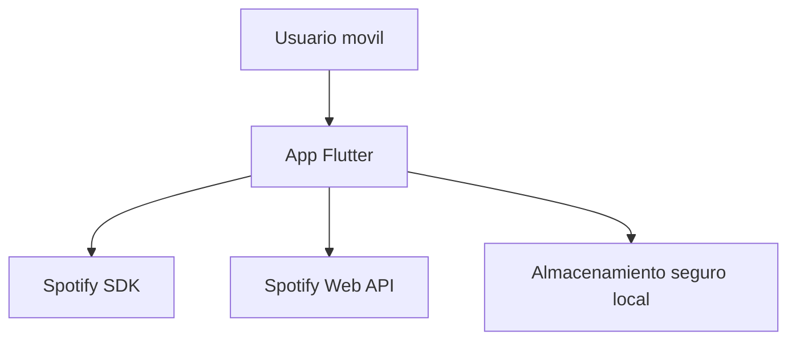
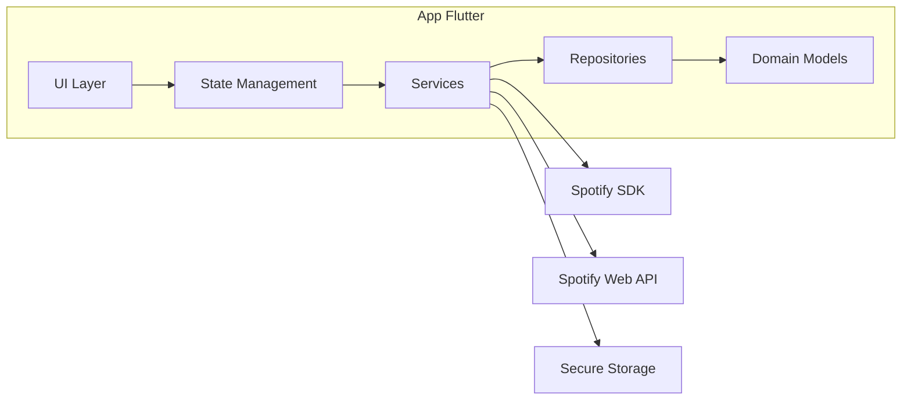
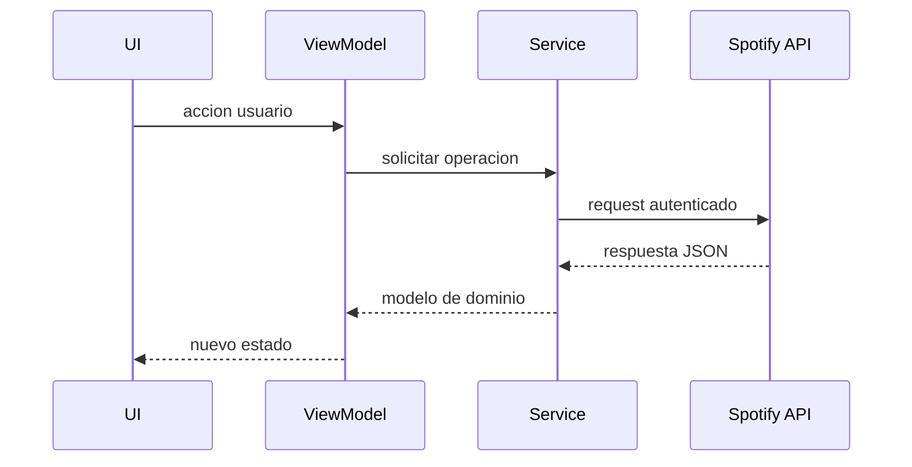

# 03. Arquitectura Tecnica

## 1. Principios de Arquitectura

- Separacion por capas: presentacion, dominio, datos e integracion.
- Bajo acoplamiento entre UI y proveedores externos.
- Manejo explicito de errores y estados de carga.
- Escalabilidad para nuevas features sin reescrituras grandes.

## 2. Vista de Contexto



## 3. Vista de Contenedores



## 4. Componentes Principales

- AuthService: login/logout, validacion y refresh de sesion.
- SpotifyApiClient: cliente HTTP para endpoints de busqueda y metadata.
- PlayerService: estado de reproduccion y posicion temporal.
- ChordEngine: resuelve progresiones y acorde activo por tiempo.
- ChordRepository: fuente de progresiones y formatos armonicos.
- SessionStore: persiste token/estado en almacenamiento seguro.

## 5. Estructura de Carpetas Recomendada

```text
lib/
  app/
    app.dart
    routes.dart
  core/
    errors/
    network/
    storage/
    utils/
  features/
    auth/
      data/
      domain/
      presentation/
    search/
      data/
      domain/
      presentation/
    player/
      data/
      domain/
      presentation/
    chords/
      data/
      domain/
      presentation/
  shared/
    widgets/
    theme/
    constants/
```

## 6. Flujo de Datos



## 7. Modelo de Dominio Basico

- UserSession
  - accessToken
  - refreshToken
  - expiresAt
  - userId

- Track
  - id
  - name
  - artists[]
  - album
  - durationMs
  - imageUrl

- PlaybackState
  - isPlaying
  - positionMs
  - trackId

- ChordSegment
  - startMs
  - endMs
  - chordLabel
  - confidence

## 8. Manejo de Errores

- Errores de red: mostrar mensajes accionables y opcion de reintentar.
- Errores de auth: forzar re-login cuando token caduque.
- Errores de permisos: mostrar guia de habilitacion.
- Errores de parseo: fallback seguro y logging local.

## 9. Seguridad

- Tokens en almacenamiento seguro, nunca en texto plano.
- Secretos fuera del repo (variables de entorno/archivos locales ignorados).
- Evitar logs con credenciales o datos sensibles.

## 10. Decisiones Arquitectonicas Clave

- DA-01: usar PKCE para evitar exponer secretos en cliente movil.
- DA-02: desacoplar cliente API para facilitar mocks y pruebas.
- DA-03: modelar acordes como segmentos temporales para sincronizacion estable.
- DA-04: introducir capa de repositorios para permitir origen de datos alterno.

## 11. Restricciones Tecnicas

- No asumir acceso al stream de audio protegido de Spotify.
- Ajustar feature de acordes a fuentes permitidas y sincronizacion por metadata.
- Priorizar compatibilidad Android en MVP, manteniendo base iOS preparada.
