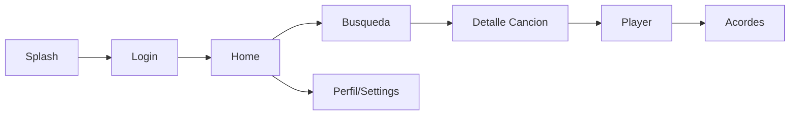

# 04. Diseno Funcional y UX

## 1. Objetivo UX

Construir una experiencia clara para practicar musica: pocos pasos, alta legibilidad de acordes y feedback inmediato en cada accion.

## 2. Principios UX

- Simplicidad: pantallas con objetivo unico.
- Legibilidad: acordes grandes, contraste alto.
- Continuidad: no perder contexto entre busqueda, player y acordes.
- Retroalimentacion: estados visibles de carga, error y exito.

## 3. Mapa de Navegacion

## 4. Flujos de Usuario

## Flujo 1: Onboarding y login

1. Usuario abre app.
2. Ve pantalla de bienvenida y boton de login.
3. Autentica en Spotify.
4. Retorna a Home autenticado.

## Flujo 2: Buscar y seleccionar cancion

1. Usuario entra a busqueda.
2. Escribe termino.
3. Revisa resultados.
4. Abre detalle de pista.

## Flujo 3: Practicar con acordes

1. Usuario inicia reproduccion.
2. App muestra timeline armonico.
3. Se resalta acorde activo segun tiempo.
4. Usuario cambia modo de vista si lo desea.

## 5. Estados por Pantalla

- Login
  - idle
  - loading
  - success
  - error

- Busqueda
  - idle
  - loading
  - resultados
  - vacio
  - error

- Player/Acordes
  - loading track
  - ready
  - syncing
  - paused
  - error

## 6. Requisitos de Interfaz

- Tipografia de acordes minimo 24 px en modo normal.
- Contraste minimo WCAG AA en textos principales.
- Espaciado tactil minimo de 44 px para botones.
- Navegacion consistente con barra superior y acciones claras.

## 7. Componentes Reutilizables

- PrimaryButton
- LoadingView
- ErrorStateCard
- TrackCard
- ChordTimeline
- SectionHeader

## 8. Microcopy Sugerido

- Login error: "No se pudo iniciar sesion. Reintenta en unos segundos."
- Empty search: "No encontramos resultados. Intenta con otro nombre."
- Chords loading: "Preparando acordes para tu cancion..."

## 9. Accesibilidad

- Soporte de escalado de fuente del sistema.
- Etiquetas semanticas en controles principales.
- Evitar depender solo de color para indicar acorde activo.
- Mantener foco visible en elementos interactivos.

## 10. Evidencias de UX para entrega

- Capturas por flujo principal.
- Video corto del recorrido end-to-end.
- Lista de mejoras detectadas en pruebas de usabilidad.
