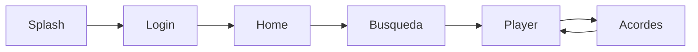

# 12. Boceto Visual de la App (Estilo Minimalista)

## 1. Objetivo del boceto

Mostrar una vista previa textual de como se vera AppMovilSpotify aplicando la guia de estilos minimalista seleccionada.

Este boceto sirve para:

- Alinear al equipo antes de implementar UI.
- Defender decisiones visuales en presentacion academica.
- Traducir tokens de diseno a pantallas concretas.

## 2. Lenguaje visual aplicado

- Fondo general claro: #F5F5F7.
- Superficies en blanco: #FFFFFF.
- Texto principal sobrio: #111111.
- Acento principal: #0071E3.
- Bordes suaves y radios medios (14 a 20).
- Espacio en blanco amplio.

## 3. Boceto de pantallas principales

## 3.1 Splash / Bienvenida

```text
+--------------------------------------------------+
|                                                  |
|                    AppMovilSpotify               |
|                Musica + Acordes en vivo          |
|                                                  |
|                  [Logo minimal]                  |
|                                                  |
|           "Practica con claridad"               |
|                                                  |
|            [ Continuar con Spotify ]             |
|                                                  |
+--------------------------------------------------+
```

Notas de estilo:

- Unico CTA principal.
- Tipografia limpia y centrada.
- Sin elementos decorativos agresivos.

## 3.2 Login Spotify

```text
+--------------------------------------------------+
|  <-                                              |
|                                                  |
|  Inicia sesion                                   |
|  Conecta tu cuenta para comenzar                 |
|                                                  |
|  [ icono spotify ]                               |
|                                                  |
|  [ Iniciar con Spotify ]                         |
|                                                  |
|  Politica de privacidad                          |
|                                                  |
+--------------------------------------------------+
```

Notas de estilo:

- Jerarquia clara: titulo -> subtitulo -> accion.
- Boton primario con color accent.

## 3.3 Home

```text
+--------------------------------------------------+
|  Hola, Carlo                                     |
|  Listo para practicar hoy                        |
|                                                  |
|  [ Buscar canciones.......................(icon) ]
|                                                  |
|  Recomendado para ti                             |
|  +--------------------------------------------+  |
|  |  Portada   Cancion A - Artista            |  |
|  +--------------------------------------------+  |
|  +--------------------------------------------+  |
|  |  Portada   Cancion B - Artista            |  |
|  +--------------------------------------------+  |
|                                                  |
|  [Inicio] [Buscar] [Player] [Acordes]           |
+--------------------------------------------------+
```

Notas de estilo:

- Cards claras con borde sutil.
- Barra inferior limpia, iconos simples.

## 3.4 Busqueda

```text
+--------------------------------------------------+
|  Buscar                                          |
|                                                  |
|  [ Que cancion quieres practicar? ]              |
|                                                  |
|  Resultados                                      |
|  +--------------------------------------------+  |
|  | Portada | Titulo cancion                    |  |
|  |         | Artista                           |  |
|  +--------------------------------------------+  |
|  +--------------------------------------------+  |
|  | Portada | Titulo cancion                    |  |
|  |         | Artista                           |  |
|  +--------------------------------------------+  |
|                                                  |
+--------------------------------------------------+
```

Notas de estilo:

- Barra de busqueda con borde redondeado.
- Tipografia secundaria en gris suave.

## 3.5 Player

```text
+--------------------------------------------------+
|  <- Reproduciendo                                |
|                                                  |
|                 [ Portada album ]                |
|                                                  |
|  Nombre de cancion                               |
|  Artista                                         |
|                                                  |
|  ----o-------------------------- 01:15 / 03:40   |
|                                                  |
|          [ << ]   [ Pause ]   [ >> ]             |
|                                                  |
|  [ Ver acordes ]                                 |
|                                                  |
+--------------------------------------------------+
```

Notas de estilo:

- Controles centrados y de facil toque.
- Barra de progreso visualmente sutil.

## 3.6 Pantalla de Acordes (Feature principal)

```text
+--------------------------------------------------+
|  <- Acordes                                      |
|  Cancion: Nombre de cancion                      |
|                                                  |
|  Acorde actual                                   |
|               [      Am      ]                   |
|                                                  |
|  Proximos                                         |
|  [F]   [C]   [G]   [Am]                          |
|                                                  |
|  Timeline armonico                               |
|  |----Am----|----F-----|----C-----|----G-----|  |
|        ^ ahora                                    |
|                                                  |
|  [Modo simple]    [Modo guitarra]                |
+--------------------------------------------------+
```

Notas de estilo:

- Acorde actual en foco absoluto.
- Proximos acordes en estilo secundario.
- Timeline simple y legible.

## 4. Mapa de transicion entre pantallas



## 5. Especificacion visual rapida por componente

- PrimaryButton

  - alto: 48
  - radio: 12
  - color: #0071E3
  - texto: blanco semibold
- SongCard

  - radio: 16
  - fondo: #FFFFFF
  - borde: #D2D2D7
  - padding: 16
- SearchField

  - radio: 14
  - borde: #D2D2D7
  - fondo: #FFFFFF
- ChordHighlight

  - fondo: #0071E3
  - texto: #FFFFFF
  - radio: 14

## 6. Criterios de aceptacion visual

- La app debe verse limpia y consistente en todas las pantallas.
- No se debe saturar con colores fuertes fuera del accent.
- Debe existir foco visual claro en accion principal de cada pantalla.
- La pantalla de acordes debe priorizar legibilidad sobre decoracion.

## 7. Proximo paso recomendado

Convertir este boceto en componentes reales de Flutter:

1. Crear tema global con tokens.
2. Implementar widgets base (boton, card, campo).
3. Maquetar las 6 pantallas del boceto.
4. Ajustar con pruebas visuales en emulador/dispositivo.

## 8. Boceto ejecutable en Dart

Se agrego un mockup funcional en:

- [12_BOCETO_VISUAL_APP.dart](12_BOCETO_VISUAL_APP.dart)

Ese archivo incluye:

- ThemeData minimalista.
- Widgets base reutilizables.
- Navegacion entre 6 pantallas de boceto.
- Vista mobile frame y vista desktop de presentacion.

Comando sugerido para ejecutarlo como entrada temporal:

```bash
flutter run -t docs/12_BOCETO_VISUAL_APP.dart
```
